# Descripción de interfaces
La aplicación consta de 6 vistas principales, estas son: registro e inicio de sesión, página principal, vista de transacciones, junto a agregar y modificar transacciones. Para acceder a cualquiera distinta de las dos primeras, se debe tener una sesión activa, por tanto, siempre se redirigirá al inicio de sesión, desde donde se puede ir al registro de sesión en caso de no tener cuenta. Además, a modo de entregar una comodidad visual al usuario, se le entrega la opción de establecer la página en modo claro y oscuro, lo que es posible cambiar presionando el botón presente en la esquina inferior derecha de cada ventana.

## Inicio de sesión
Entonces, las primeras vistas a señalar son el inicio y registro de sesión. A continuación se presentan las imagenes correspondientes a estas, primero en modo claro:

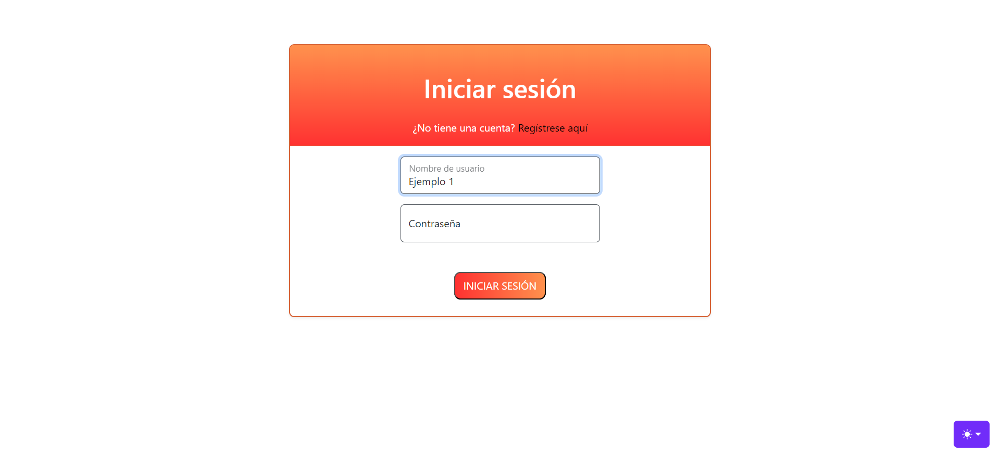
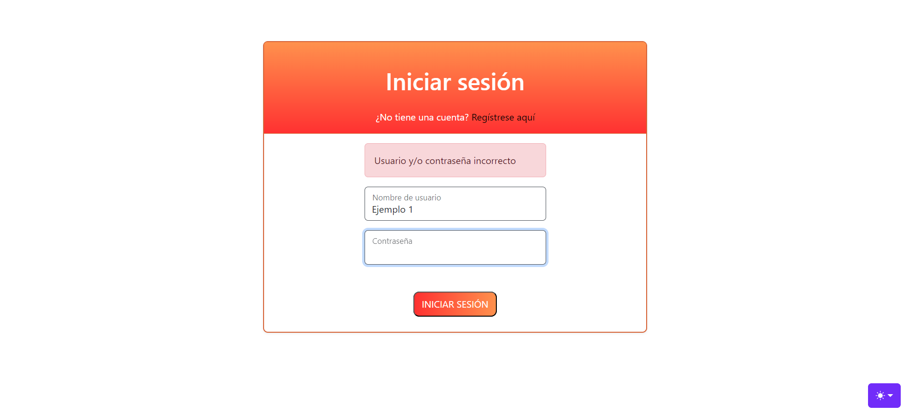

Es posible visualizar también de qué manera se puede ver la presencia de errores en el formulario, por ejemplo si el nombre de usuario o contraseña no es correcto. Entonces, a continuación se presenta lo mismo, pero para modo oscuro:

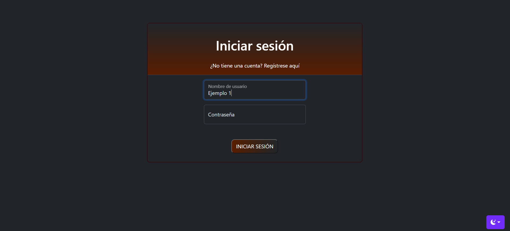
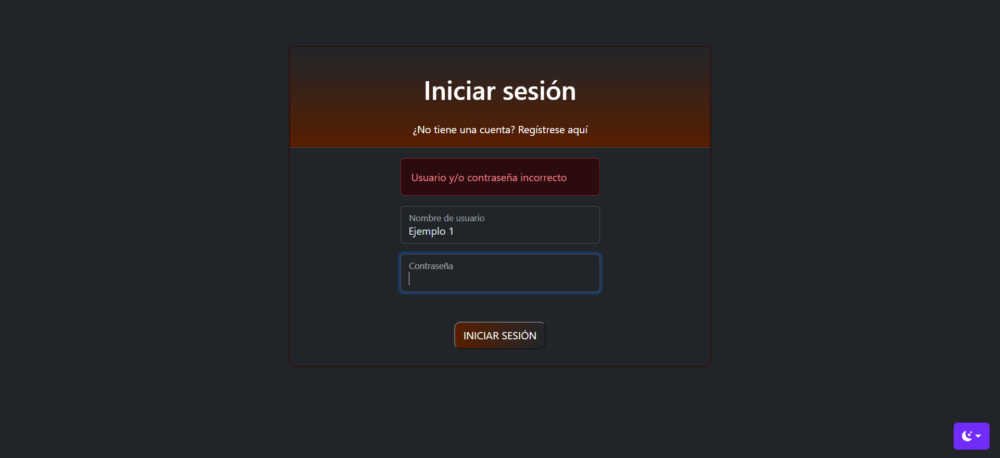

## Registro de usuario
Para el registro de usuario se tiene algo idéntico a lo visto en el inicio de sesión, pero tan solo se tienen más campos:

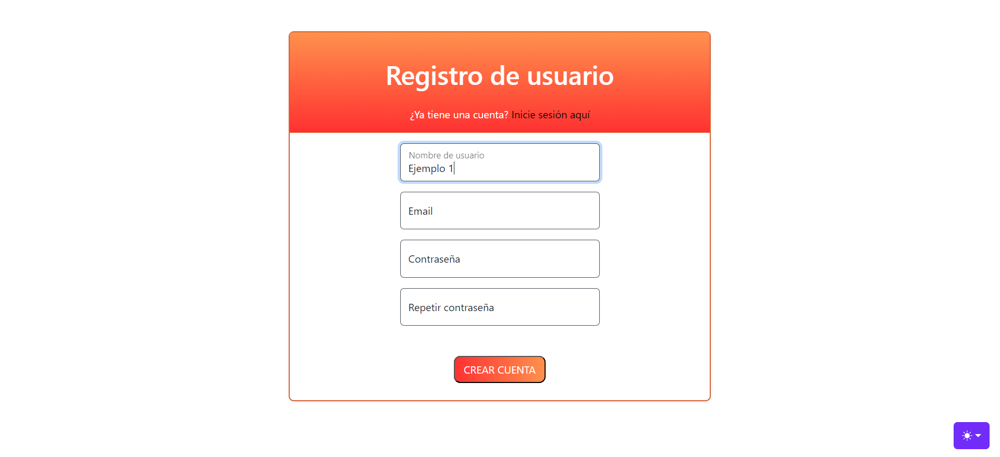
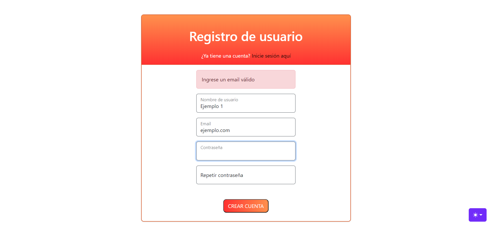

Es posible visualizar también la presencia de errores en el formulario, por ejemplo si el nombre de usuario o contraseña no es correcto. Entonces, a continuación se presenta lo mismo, pero para modo oscuro:

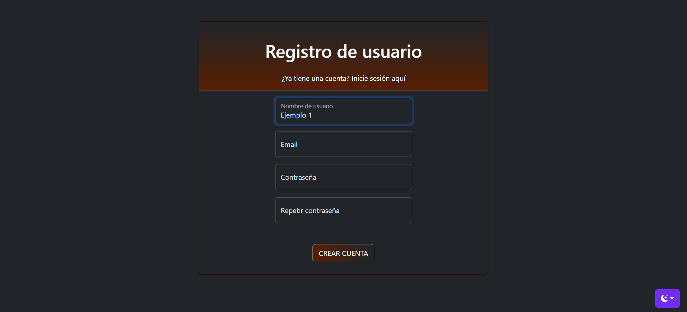
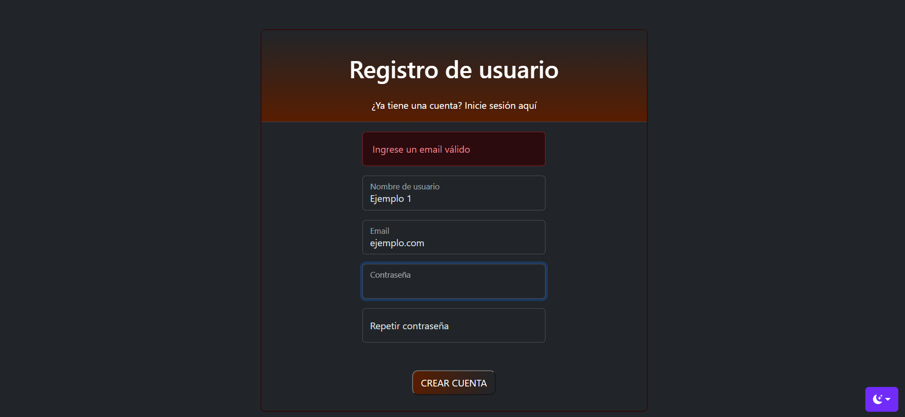

## Página principal
Una vez se pudo efectuar un correcto inicio de sesión, por ejemplo en este caso para el usuario de nombre 'Rodrigo Hidalgo', se puede acceder a la página de finanzas. Lo primero que se observa para dispositivos de tamaño grande es una barra lateral que permite ir a otras secciones de la página; para dispositivos de tamaño menor esta no aparece inmediatamente, sino que hay que presionar un botón que la despliegue (esto por temas estéticos y de orden). Es posible contraer y expandir esta barra lateral a conveniencia, tan solo presionando la 'X' cuando esta está, o el botón de abir menú en la esquina superior izquierda, respectivamente. A continuación se presentan las distintas vistas disponibles de la página principal cuando no hay transacciones disponibles; cuando sí hay se mostrará al final de este archivo.

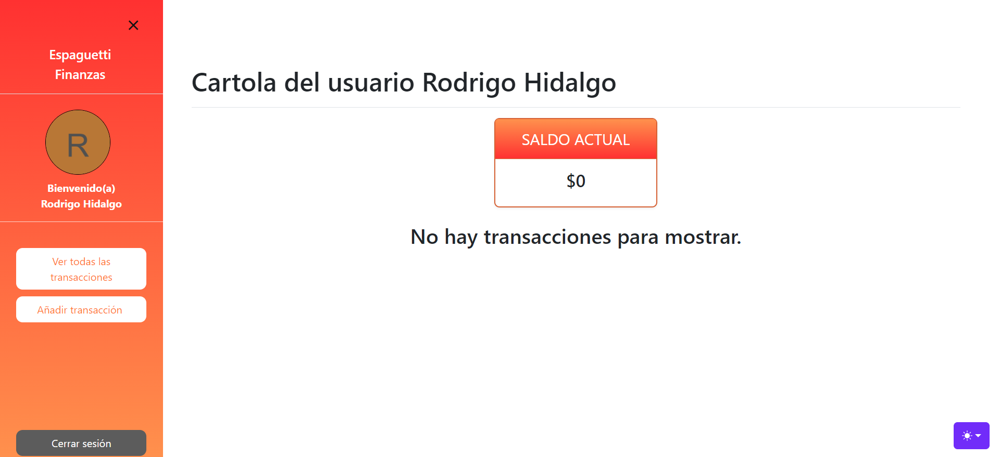
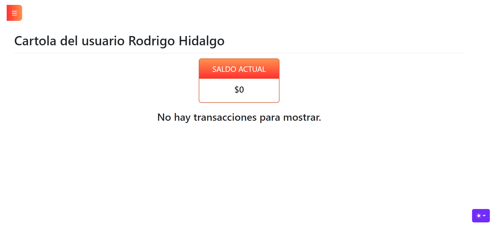

Análogamente para el modo oscuro: 

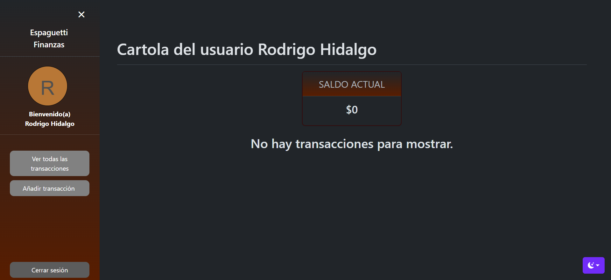
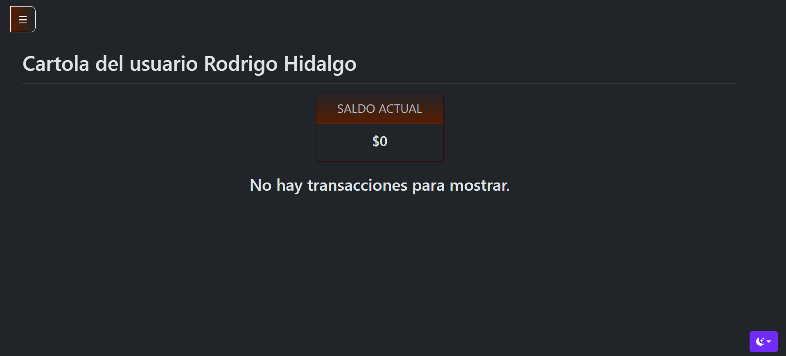

## Añadir transacción
Es posible llegar a esta sección haciendo uso del botón 'Añadir transacción' de la barra lateral en la página principal. Aquí se añaden transacciones, estableciéndose un tipo de transferencia, tipo de transacción, cantidad, fecha y comentario. Para los dos primeros campos, al presionar en estos se despliegan todas las posibles selecciones, por su parte la cantidad debe ser un número entero, la fecha es posible seleccionarla desde el calendario que se muestra, y el comentario es opcional. Para cada uno de estos campos hay validaciones que arrojan algún error en caso de que no se cumplan las condiciones, lo que no se mostrará porque es idéntico al inicio y registro de sesión. Lo siguiente que se mostrará será el añadido de alguna transacción, y a su vez la confirmación que se debe realizar para hacer esto (luego de presionar 'Agregar'), tanto para modo claro como oscuro: 

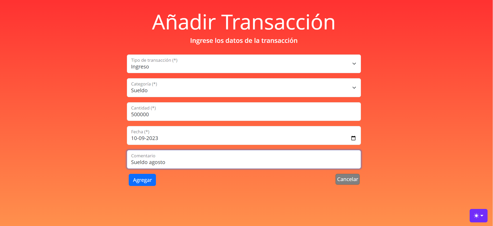
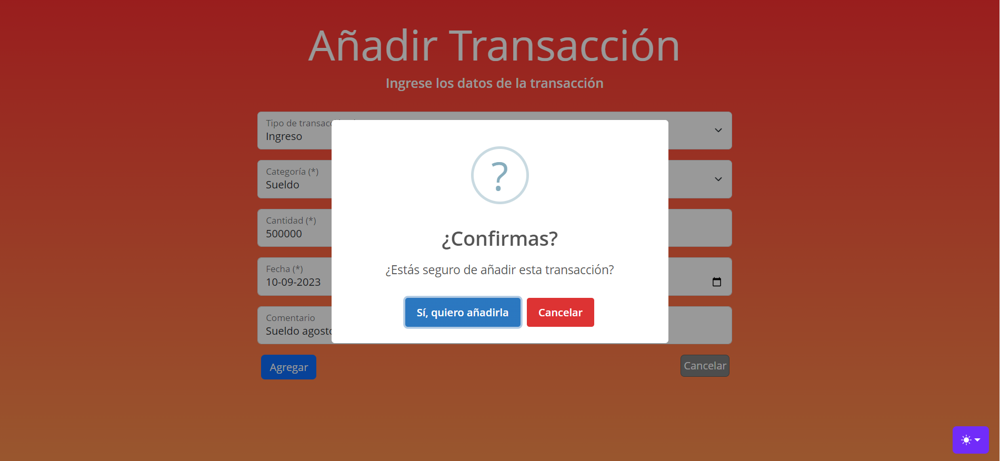

Análogamente para el modo oscuro: 

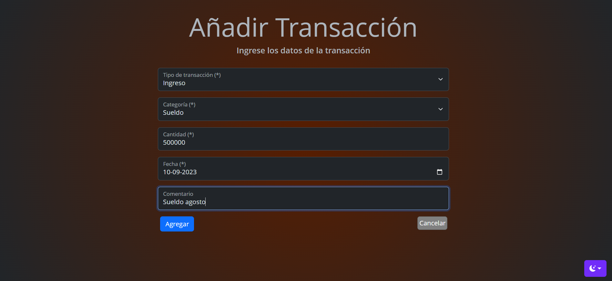
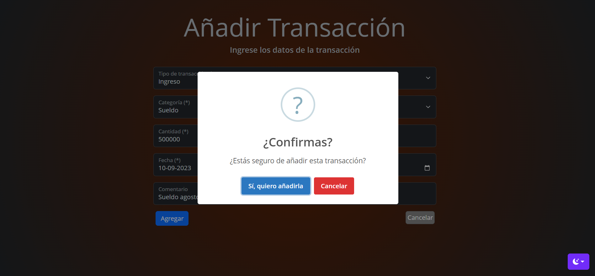

## Vista de transacciones
Una vez se añade alguna transacción, se realiza una redirección a la sección de vista de transacciones, a la que también es posible llegar desde la página principal mediante presionar el botón de 'Ver todas las transacciones'. En esta sección se muestran todas las transacciones agregadas, y se da la opción de filtrar estas de distintas maneras, a modo de darle libertad al usuario de visualizar algunas específicamente. Junto a lo anterior, es posible eliminar transacciones presionando el cuadrito que está junto a 'Editar' de cada transacción, y luego presionar 'Borrar seleccionados'. Además de borrar una por una, se pueden seleccionar y deseleccionar múltiples transacciones y borrarlas. Como detalle extra, es posible borrar todas las de un cierto tipo, categoría o lo que sea que se haya filtrado; basta con filtrar de alguna manera las transacciones, luego presionar 'Borrar seleccionadas' y esto borrará solo las transacciones que correspondan al filtro establecido. Para cada acción de borrado siempre se consulta la confirmación por parte del usuario. 

Mencionado todo lo anterior, también es posible editar alguna transacción si es que algún dato no concuerda con lo que se quiso poner, lo que se mostrará posteriormente en este archivo. Por ahora, se mostrará la vista de transacciones luego de haber añadido 5 transacciones: 

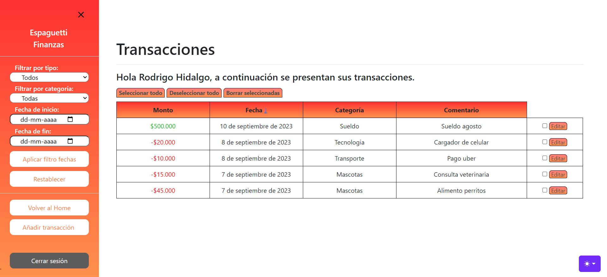

Análogamente para el modo oscuro: 

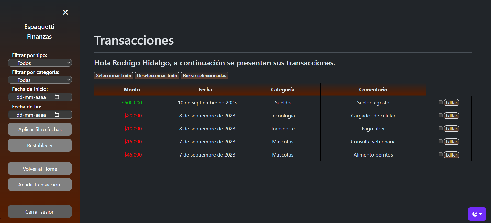

## Modificar transacción
Es posible llegar a esta sección desde la anterior sección descrita, es decir, la vista de transacciones. En esta, si se deseara cambiar algún campo de la transacción, es posible realizarlo siempre que los nuevos datos ingresados sean correctos; se mostrará el error que corresponda si es que lo hay. Al igual que para añadir, se debe realizar confirmación de los cambios si se desea efectuarlos. A continuación se muestra esto en modos claro y oscuro:

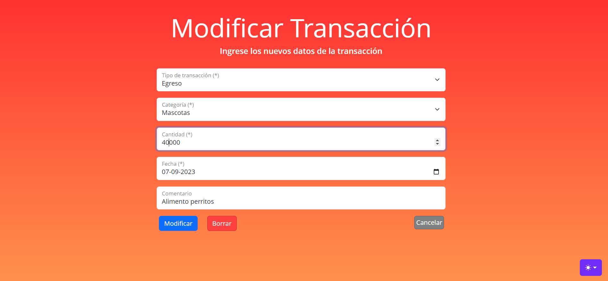

Análogamente para el modo oscuro: 

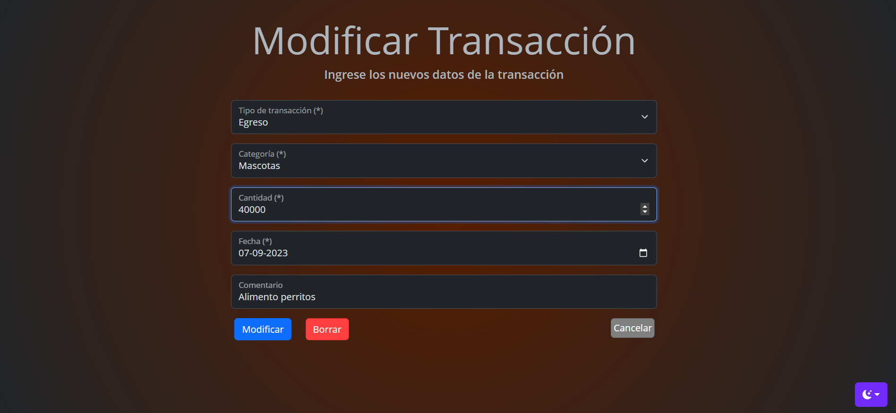

## Página principal con información
Una vez se haya interactuado con la aplicación y se hayan añadido transacciones, la página principal se verá de la manera que a continuación se mostrará, con un listado de las últimas 5 transacciones en fecha: 

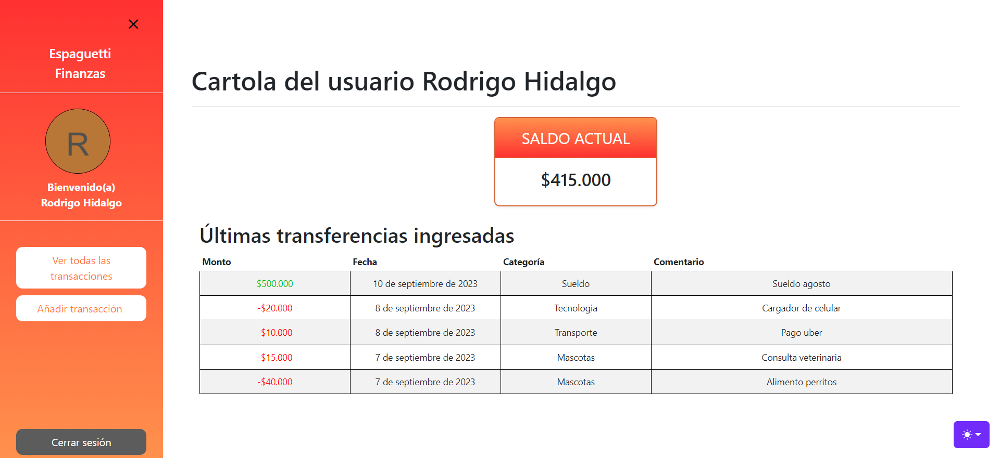

Análogamente para el modo oscuro: 

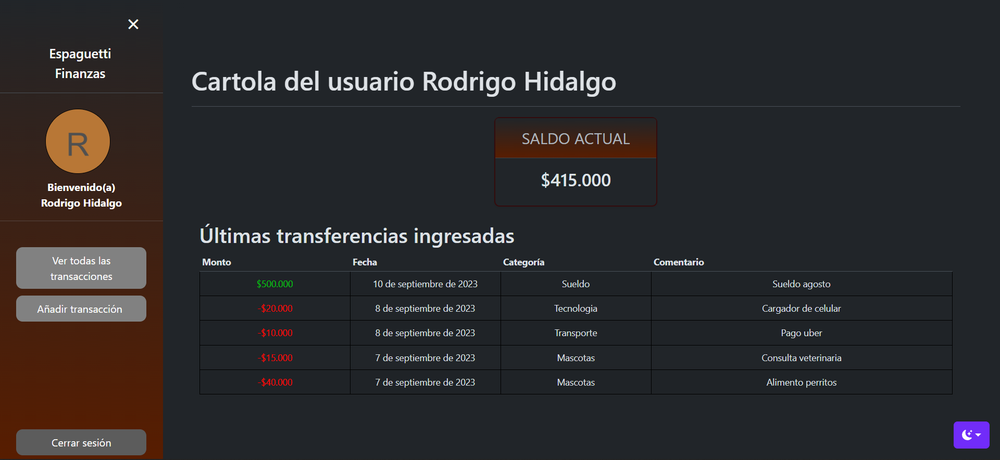